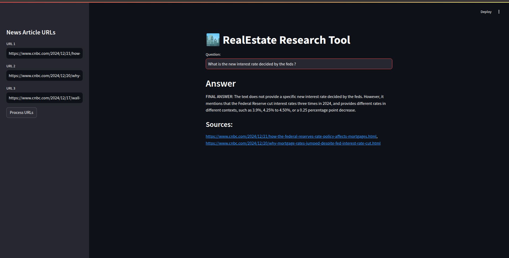

# 🏙️ **Real Estate Research Tool**

This repository provides a user-friendly research tool designed for seamless information retrieval from real estate news articles. Users can input article URLs and ask domain-specific questions to receive relevant insights, along with source references. Though tailored for the real estate domain, the features are adaptable to other domains with minimal modifications.



---

## Features

- **Content Extraction**: Load URLs to fetch and process article content using LangChain's UnstructuredURLLoader.
- **Embeddings and Vectorization**:
  - Create embeddings using HuggingFace models.
  - Leverage ChromaDB as the vector store for efficient information retrieval.
- **Intelligent Querying**:
  - Interact with LLMs (e.g., Llama 3 via Groq) by inputting questions.
  - Receive precise answers with source URLs for context and validation.

---

## Articles Used

In the  development process, the following news articles were used:

1. [How the Federal Reserve's rate policy affects mortgages](https://www.cnbc.com/2024/12/21/how-the-federal-reserves-rate-policy-affects-mortgages.html)
2. [Why mortgage rates jumped despite Fed interest rate cut](https://www.cnbc.com/2024/12/20/why-mortgage-rates-jumped-despite-fed-interest-rate-cut.html)
3. [Wall Street sees upside in 2025 for these dividend-paying real estate stocks](https://www.cnbc.com/2024/12/17/wall-street-sees-upside-in-2025-for-these-dividend-paying-real-estate-stocks.html)

These articles were processed to demonstrate the tool's capabilities and test its effectiveness.

## Project Structure

The repository is organized as follows:

### 1. **Main Files**
- `main.py`: Hosts the Streamlit web app, providing an interface for URL input, query submission, and result display.
- `rag.py`: Contains the core logic for data loading, embedding creation, vector storage, and query processing.

### 2. **resources**
- The `resources/` directory contains the vector store database generated from embeddings.

---

## Technical Details

### Workflow

1. **Data Loading**:
   - URLs are loaded using LangChain's UnstructuredURLLoader to extract article content.
   - Text is preprocessed and split for optimal embedding creation.

2. **Embedding and Storage**:
   - HuggingFace Embeddings are used to generate vector representations of the article content.
   - Embeddings are stored in ChromaDB, enabling efficient similarity-based retrieval.

3. **Querying and Insights**:
   - User queries are processed with LLMs (e.g., Llama 3 via Groq).
   - Results are matched with embeddings for relevance and returned with source links for transparency.

### Tools and Libraries

- **LangChain**: For article content extraction and text processing.
- **HuggingFace Transformers**: Embedding generation using pre-trained language models.
- **ChromaDB**: Vector store for efficient similarity search and retrieval.
- **Streamlit**: User interface for interaction and insights.
- **Python**: Core programming language for implementation.

---

## Set-Up

### 1. Install Dependencies

Run the following command to install all required libraries and frameworks:

```bash
pip install -r requirements.txt
```

### 2. Set Environment Variables

Create a `.env` file in the root directory with the following credentials:

```text
GROQ_MODEL=MODEL_NAME_HERE
GROQ_API_KEY=GROQ_API_KEY_HERE
```

### 3. Launch the Application

Run the Streamlit app using:

```bash
streamlit run main.py
```

---

## Usage

### Step-by-Step Guide

1. **Input URLs**: Provide article URLs via the sidebar.
2. **Process Articles**:
   - Initiate content extraction and processing by clicking "Process URLs."
   - Observe as embeddings are generated and stored in ChromaDB.
3. **Query the System**:
   - Ask domain-specific questions in the query box.
   - Receive detailed answers with reference URLs for further exploration.

---

## Future Enhancements

- Support for multi-language article processing.
- Integration with additional vector stores for scalability.
- Enhanced LLM integration for deeper insights and context.

---

Feel free to contribute by raising issues or submitting pull requests for new features and improvements!

